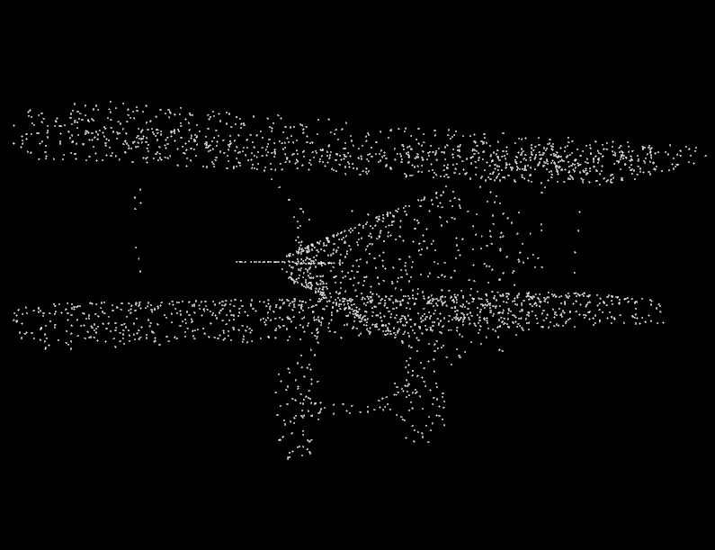

# What
This is simple PointCloud(pts) Viewer




# How
When you use your cudtom data, please use intreractive mode
```
//example
string filepath = "data/1a04e3eab45ca15dd86060f189eb133.pts";

//interactive mode
//string filepath;
//cout << "input filepath = ";
//cin >> filepath;
//cout << "filePath : " << filepath << "‚Å‚·\n";
```